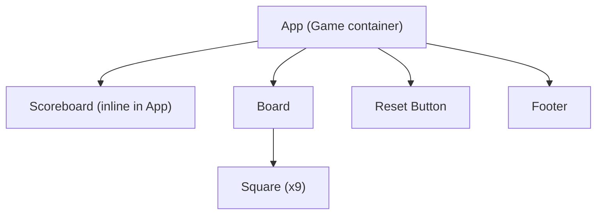

# Tic Tac Toe Frontend – Architecture Document

## Overview

This document describes the architecture of the _tic_tac_toe_frontend_ React application, a minimalistic and modern web-based Tic Tac Toe game, highlighting its main components, state management, rendering flow, layout strategies, win/draw logic, and theme/color palette enforcement.

---

## Component Structure

The main entry point is `src/index.js`, which renders the `App` root component. The component hierarchy is as follows:

- **App** (in `App.js`)
  - _Scoreboard Section_: Displays scores for X, O, and draws.
  - _Board_: The 3x3 grid for game interaction.
    - _Square_: Renders each individual cell on the board.
  - _Reset Button_: Resets the game board.
  - _Footer_: Displays brand information.

### Component Breakdown

- **App**: Main container that holds all game logic and state, orchestrates layout, and renders child components.
- **Board**: Renders the 3x3 grid and delegates each square to the `Square` component.
- **Square**: A single game cell, recognizes click events, and displays either "X", "O", or nothing.
- **Scoreboard**: Inline within `App`, visualizes running scores for both players and draws.
- **Footer**: Displayed below the board with light branding.

---

## State Management

All game state is managed locally within the `App` component using React's `useState` and `useEffect` hooks. There is no usage of external global state, Redux, or context.

- **Board State**:  
  `const [squares, setSquares] = useState(Array(9).fill(null));`  
  Represents the state of all 9 cells on the board; each can be `"X"`, `"O"`, or `null`.
- **Turn State**:  
  `const [xIsNext, setXIsNext] = useState(true);`  
  Indicates whose turn it is (X or O).
- **Score State**:  
  `const [score, setScore] = useState({ X: 0, O: 0, draw: 0 });`  
  Tracks the count of wins for X, wins for O, and draws. These are incremented after game conclusion and persist (in memory) until page reload.

State changes (such as moves, win/draw, and resets) are managed via direct handlers or effect hooks for automatic score updating following game completion. The states are shared with child components through props.

---

## Rendering Flow

1. **Initialization:**  
   The root `<App />` component is rendered into the DOM by `index.js`.
2. **Game Interaction:**  
   - Player clicks a square (if it’s empty and the game isn’t over).
   - The `handleSquareClick` function is called. The square is filled with the current player's mark and the turn advances.
   - The game checks for a win or draw using helper functions:
     - `calculateWinner(squares)` – Determines if a win state exists.
     - `isDraw(squares)` – Checks for a board fill with no winner.
     - `getWinningLine(squares)` – Returns the indices of a winning line so that the UI can highlight the win.
   - On win/draw, the effects update scores and communicate the game's status.

3. **Reset:**  
   The reset button clears the board. If the last round ended, the next game starts with the other player for fairness.

4. **UI Feedback:**  
   - The status bar updates with "Next: Player X/O", "Winner: Player X/O", or "It's a draw!".
   - Winning squares are visually highlighted.

---

## Layout & Responsiveness

- **Centralized Layout:**  
  `.ttt-app-bg` encapsulates the app and uses flex alignment to keep everything centered, regardless of viewport size.
- **Container:**  
  `.ttt-container` uses background color, rounded corners, and drop shadows for a card-like appearance. Sizing is fluid, supporting both desktop and mobile devices.
- **Responsive Design:**  
  Via CSS media queries (`@media (max-width: 480px)`) in `App.css`, paddings, font sizes, button and board square sizes adapt to small screens, ensuring usability on touch devices.
- **Scoreboard & Board:**  
  Flexbox layouts allow the scoreboard, game board, and controls to remain visually distinct and readable on all viewport sizes.
- **Footer:**  
  Sticks to the bottom of the container, using muted text styles.

---

## Win/Draw Logic

- **Win Detection:**  
  The `calculateWinner` function iterates through all possible win lines and returns "X" or "O" if one is achieved. The `getWinningLine` function provides the cells involved so they can be visually highlighted.
- **Draw Detection:**  
  The `isDraw` function returns `true` if all board cells are filled and there is no winner.
- **Win/Draw Feedback:**  
  On win, the winning line is colored (using `.highlight` CSS), a winner message is displayed, and score for the winner increased. On draw, scores update accordingly and a distinct message is shown.

---

## Color Palette & Theme Enforcement

- **CSS Variables:**  
  The color palette is defined in `App.css` under the `:root` selector. Key variables:
  - `--color-primary`: Blue (#4A90E2)
  - `--color-secondary`: Greyish (#7B8D8E)
  - `--color-accent`: Orange (#F5A623)
  - Board BG, text, borders, and various accents also use additional variables.
- **Component Styling:**  
  - Colors for "X", "O", draws, scores, and highlights are referenced via CSS variables for maintainability.
  - The reset button uses a linear gradient of primary and accent colors for emphasis.
  - Muted text and brand colors create a minimalist and modern UI.
- **Theme:**  
  The theme is "light", with plenty of whitespace and gentle backgrounds, consistent with KAVIA branding and minimal design principles.

---

## High-Level Component Diagram

Below is a Mermaid diagram visualizing the structure and interactions:

---

## Summary

The tic_tac_toe_frontend React application follows a classic, focused architecture. All functionality is managed locally in the App component, with stateless functional components for rendering. It leverages CSS variables for enforcing its branded modern theme, and utilizes minimal, clear logic for win/draw state evaluation. The UI remains accessible and usable across devices, with a responsive layout by design.

---

**Sources:**
- `src/App.js`
- `src/App.css`
- `src/index.js`
